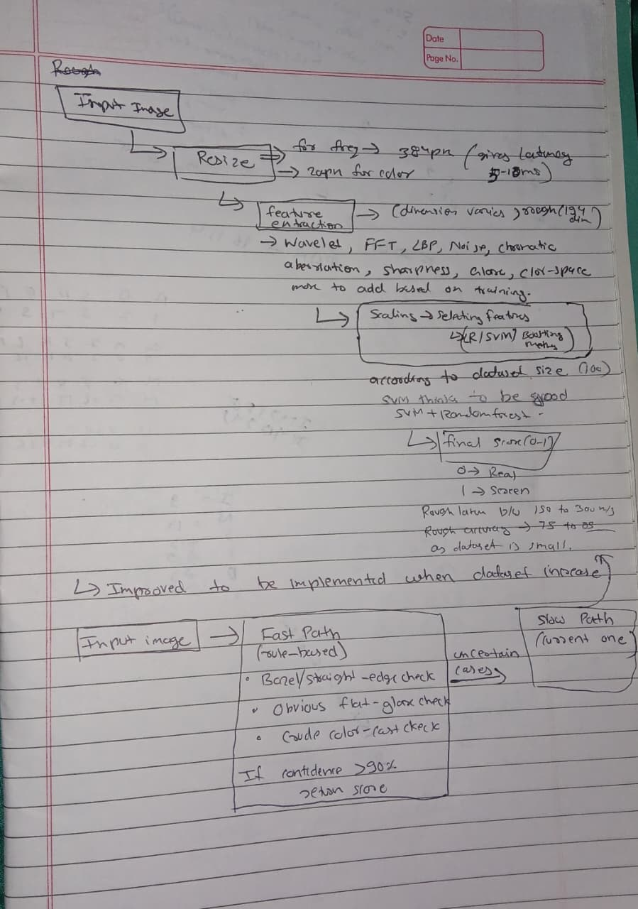

# Spot the Fake Photo (Approach Note)

## What I did

- Used classical computer vision techniques instead of a deep neural network — dataset was small, and the assignment allowed traditional methods too.
- Combined 8 signals commonly used in recapture/screen-detection tasks:
  - Wavelet sub-band statistics
  - FFT-based moiré patterns
  - LBP texture
  - Noise residuals
  - Chromatic aberration near edges
  - Sharpness and blur statistics
  - Glare and highlight features
  - Color-space statistics
- Merged all 8 signals into a 194-dimensional feature vector per image.
- Same feature extraction pipeline (`features.py`) used consistently in the notebook, `predict.py`, and the Streamlit demo — avoids any mismatch between training and inference.
- Texture/frequency features computed on a larger 384px image; color/glare features extracted from a 200px thumbnail, for speed.
- Final model: StandardScaler → SelectKBest → Logistic Regression.
- Also tested RBF SVM and Random Forest — Logistic Regression won on cross-validation performance, so that's what shipped.

## Accuracy

- Dataset: 100 images — 50 real photos, 50 screen recaptures, self-collected with varied lighting, angles, and screens.
- 5-fold cross-validation accuracy: **90%**
- ROC-AUC: **0.955**
- Confusion matrix was balanced: 45/50 real and 45/50 screen classified correctly.
- Train accuracy was 93%, but that's not the reported number — it's measured on data the model already saw.
- 90% CV accuracy is the honest, reliable metric.
- Small dataset means this number could shift a bit with more data.

## Latency & Cost

- Average inference time: ~150–180 ms per image on Colab CPU, single-threaded, including image loading.
- Median time slightly lower, depending on the run.
- Lightweight numerical operations (no deep learning) → runs efficiently on a local system or mobile device, no GPU needed.
- If deployed on a server, compute cost stays low — no model download, no network call required per prediction.

## What I would improve

- Biggest limitation: small dataset size. More images across different screens, devices, and lighting would likely make the model more robust.
- Test on completely unseen screens/devices instead of relying only on cross-validation.
- Explore gradient boosting methods (XGBoost, LightGBM) to capture feature interactions a linear model might miss.

## Architecture

  

